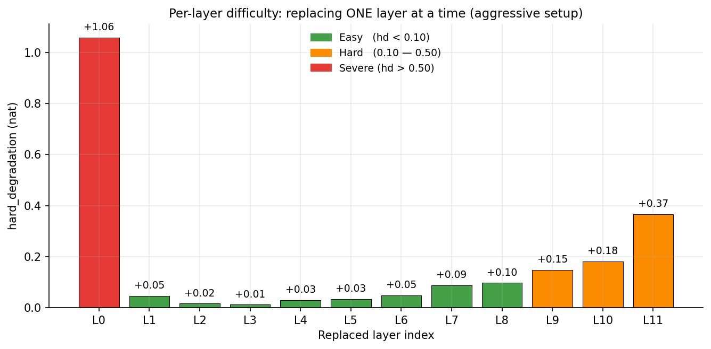
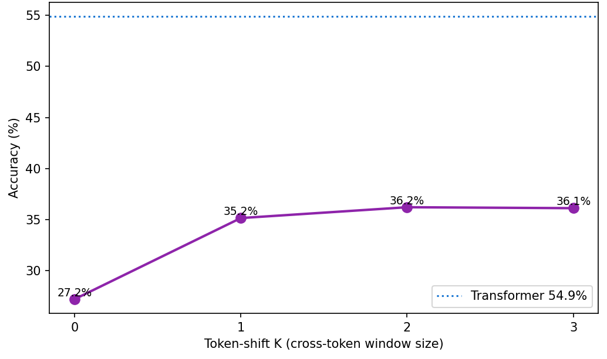

# LGN-Nano: Logic Gate Networks transformerio sluoksniuose

Tikrinu, kiek nanoGPT transformerio sluoksnių galima pakeisti į Boolean **Learned Logic
Gate Networks (LGN)** — ir ar iš to lieka realaus loginio darbo, ar tik aplinkinių Linear
sluoksnių kompensacija. Modelis: nanoGPT, 12 sluoksnių × 128d × 4 head'ai, byte-level
WikiText-2.

Trumpa esmė: per paskutinę savaitę išbandžiau ne vieną būdą pagerinti LGN, pritaikant jį
transformerio sluoksniams. Atsiremiu į aiškias **lubas**, kurių nepavyksta pramušti
paprastais architektūros pataisymais (funkcijų modifikavimai, gylis ir pan.). Nepaisant to,
kad LGN geriausiu atveju yra apie **35 % (santykinai) mažiau tikslus** nei transformeris,
jis yra gerokai **efektyvesnis** — kelis kartus mažiau parametrų ir 8–30× mažiau FLOPs,
priklausomai nuo konfigūracijos.

---

## Modelių apžvalga

| Modelis | Accuracy % | Ką keičia |
|---|---:|---|
| NanoGPT transformeris | **54.87** | 12 sluoksnių baseline (lubos) |
| Combo Hybrid LGN | 36.45 | L0 su pre-baked attention + token-shift K=2 |
| LGN + Transformer (selective) | 39.01 | 8 LGN + 4 transformer sluoksniai |
| Hybrid L0 | 33.5 | L0 attention pre-baked, MLP → LGN |
| Tik LGN (aggressive) | 27.22 | visi 12 sluoksnių grynas LGN |
| Identity | 23.25 | kontrolė (LGN nieko nedaro) |

Nustačiau, kad pagrindinis bottleneck, dėl kurio krenta visas tikslumas, yra **L0 (pirmas
sluoksnis) cross-token bottleneck**. Bandymai pagerinti būtent jį davė daugiausiai naudos, o
Boolean skaičiavimo optimizacijos (gilesni sluoksniai, platesni vartai, conv/linear
projekcijos) nedavė nieko arba labai nedaug. Problema ta, kad **kiekvienas tokenas pats iš
savęs daug nereiškia** — informacija ateina iš konteksto, kokie tokenai buvo prieš jį.
Transformeryje attention leidžia referencuoti buvusius tokenus, o LGN kiekvieną poziciją
apdoroja atskirai (pointwise), todėl praranda daug tikslumo.

---

## Hybrid L0

Aproachas, kuris neblogai veikia. Transformerio blokas turi dvi dalis — **MLP** ir
**attention**, ir aš keičiu tik MLP dalį. L0 sluoksniui **nukopijuoju attention dalį iš jau
ištreniruoto transformerio** (palieku ją užšaldytą), o LGN naudoju tik vietoj MLP. Taip LGN
gauna nebe raw embedding'ą, o **attention jau apdorotą srautą** — tokenus, į kuriuos jau
įmaišyta informacija iš kitų pozicijų. Tai pakelia accuracy nuo 27.2 % iki **33.5 %**.

---

## TokenShift

Metodas, kuris irgi davė neblogų rezultatų, ir net stipresnių nei Hybrid. Prieš paduodant
signalą į LGN sluoksnį, prie kiekvienos pozicijos **pridedu keletą praėjusių pozicijų** —
LGN mato `[x[t], x[t-1], ..., x[t-K]]`. Tarkim, K=2 reiškia, kad pozicija mato save ir 2
atgal. Tai duoda vartams lokalų cross-token langą **pigiai ir sąžiningai** (tik fiksuotas
pozicijų postūmis, jokių mokomų parametrų — skirtingai nei conv/linear, kur papildomas
sluoksnis pats išmoktų dalį darbo).

| Config | Accuracy % |
|---|---:|
| Be cross-token | 27.22 |
| Token_shift K=1 | 35.16 |
| **Token_shift K=2** | **36.22** |
| Token_shift K=3 | 36.13 |

Priešingai nei Hybrid, TokenShift taikiau **visiems sluoksniams** (labiausiai naudingas L0
ir L10/L11 — būtų galima sutaupyti resursų taikant tik ten). Šie du metodai aiškiai sprendžia
**tą pačią** problemą: jų kombinacija beveik nieko nepakeičia (Combo tik truputį geriau nei
vienas Token_shift), todėl TokenShift neblogai imituoja attention dalį.

---

## Selective LGN

Patikrinau, kiek galima palikti transformer sluoksnių, paaukojant efektyvumą už tikslumą.

| Palikti transformer | LGN sluoksnių | Accuracy % | Parameters |
|---:|---:|---:|---:|
| 0 | 12 | 27.22 | 0.37 M |
| 1 (L0) | 11 | 34.70 | 0.55 M |
| 2 (L0, L11) | 10 | 37.03 | 0.72 M |
| 4 (L0, L1, L10, L11) | 8 | 39.01 | 1.07 M |
| 12 (baseline) | 0 | 54.87 | 2.45 M |

---

## Literatūra

Peržvelgiau keletą naujesnių DLGN darbų:

- **„Mind the Gap" (NeurIPS 2025)** — bando soft–hard gap'ą mažinti Gumbel noise + STE.
  Jų image rezultatai geri, bet mano byte-LM setup'e nepasiteisino.
- **„Light DLGN" (2025)** — vartų reparametrizacija (IWP): 4× mažiau parametrų, greitesnis
  training. Irgi labiau tinka image recognition, čia nepasiteisino (−5 pp).
- **[Recurrent DDLGN (2025)](https://arxiv.org/abs/2508.06097)** — nagrinėja, manau,
  pagrindinę problemą: cross-token apribojimą. Į loginį tinklą įdedami **stateful vartai
  (flip-flops, latches)**, kurie leistų vartams dirbti su sekomis — galimai pakeistų
  attention pačiame LGN lygmenyje. Reikalauja didelio architektūros pertvarkymo; dar
  nespėjau patikrinti.
- **[CAGE „Align Forward, Adapt Backward" (2026)](https://arxiv.org/abs/2603.14157)** —
  sprendžia soft/hard gap'ą: forward daromas kietas (argmax, lygiai kaip inference), tad
  gap'as iš principo dingsta, o gradientas skaičiuojamas minkštai su adaptyvia temperatūra.
  Įdiegiau — gap'ą sumažino maždaug perpus (0.027 → 0.014), bet accuracy beveik nepasikeitė
  (27.0 % vs 27.2 %), nes mano gap'as ir taip buvo mažas.

---

## Konfigūracijos, kurios nieko reikšmingo nedavė

| Bandymas | Rezultatas | Kodėl |
|---|---|---|
| Depth + random interconnect | 25.3–26.3 % (kiek pablogėjo) | hard-snap klaidos kaupiasi |
| Conv/Linear projekcijos | „veikė labai gerai", bet ablation parodė, kad LGN tada nieko nebedaro | projekcija perima darbą (fake LGN) |
| Binary regularization (RDDLGN) | nieko nepagerina | — |
| Reverse greedy (sunkiausi pirma) | −1 pp | easy-first leidžia tinklui prisitaikyti |

---

## Efektyvumas

Kadangi pasiekti identiškų transformeriui rezultatų kol kas nepavyko, patikrinau, kiek
laimime efektyvumo. FLOPs/token — teorinis aritmetinių operacijų kiekis vienam tokenui,
susumuotas per 12 blokų: transformer bloke skaičiuoju attention + MLP matricų daugybas
(~213K/token bloke → 2.56 M iš viso), LGN bloke Linear sluoksnių nėra — lieka tik vartai
(kiekvienas ≈ 5 operacijos) ir sum_pool (~6K/token bloke → 0.075 M), t.y. ~34× mažiau.

| Config | Total params | FLOPs/token | LGN gates | Bool ops/token | FLOPs vs transformer |
|---|---:|---:|---:|---:|---:|
| Transformer | 2.45 M | 2.56 M | 0 | 0 | 1.0× |
| Aggressive | 0.37 M | 0.086 M | 12,288 | 36,864 | **29.7× fewer** |
| Hybrid L0 | 0.44 M | 0.168 M | 12,288 | 36,864 | 15.2× fewer |
| Token shift K=2 | 0.96 M | 0.258 M | 36,864 | 110,592 | 9.9× fewer |
| Combo | 1.03 M | 0.340 M | 36,864 | 110,592 | 7.5× fewer |

Realių hardware skaičių nelyginau, nes ant GPU LGN visada veikia prasčiau už transformerį —
GPU optimizuotas tankiai matricų daugybai, o diskretus „gather + gate eval" jam neefektyvus.
Tikrasis pranašumas realizuojamas **FPGA/ASIC**, kur kiekvienas 2-input vartas = 1 LUT.

---

## Kryptys toliau

Turiu dar keletą krypčių, bet labiausiai perspektyvi (RDDLGN stateful vartai) reikalauja
gano didelio visos architektūros pertvarkymo. Dabartinės implementacijos jau ženkliai
padidina efektyvumą FPGA/ASIC kontekste.
