# LGN-Nano: Logic Gate Networks transformer'io sluoksniuose

Tikrinu, kiek nanoGPT transformer'io MLP sluoksnių galima pakeisti į Boolean **Learned Logic Gate Networks (LGN)** sluoksnius, ir ar iš to lieka realaus loginio darbo, ar tik aplinkinių Linear sluoksnių kompensacija.

**Modelis:** nanoGPT, 12 sluoksnių × 128d × 4 head'ai, byte-level WikiText-2.
**LGN blokas:** 16-vartų Bool polinomas `c₀ + c₁·A + c₂·B + c₃·A·B` su soft → hard snap ir temperatūros annealing'u.

---

Pradėjau nuo iš anksto pasiūlytų krypčių: aktyvacijos funkcijos, dropout, init scale, per-layer annealing, gilesni kraštiniai sluoksniai. Čia daug nesiplėsiu, nes po identity ablation testo šie rezultatai tapo nelabai aktualūs.

## 1.1 Aktyvacijos funkcija

Pirmiausia dariau parametrų sweep. Išbandžiau tris aktyvacijos funkcijas, siekdamas pagerinti pirmą ir paskutinį sluoksnius: sigmoid (baseline), tanh ir relu. Geriausiai vis tiek liko sigmoid, tanh ir relu ypač blogai veikė kraštiniuose sluoksniuose.

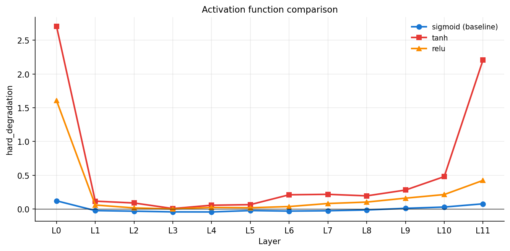

Tas pats matosi ir sharpness grafike. Sigmoid po fine-tune pasiekia apie 0.96 max-softmax, o tanh ir relu veikia prasčiau.

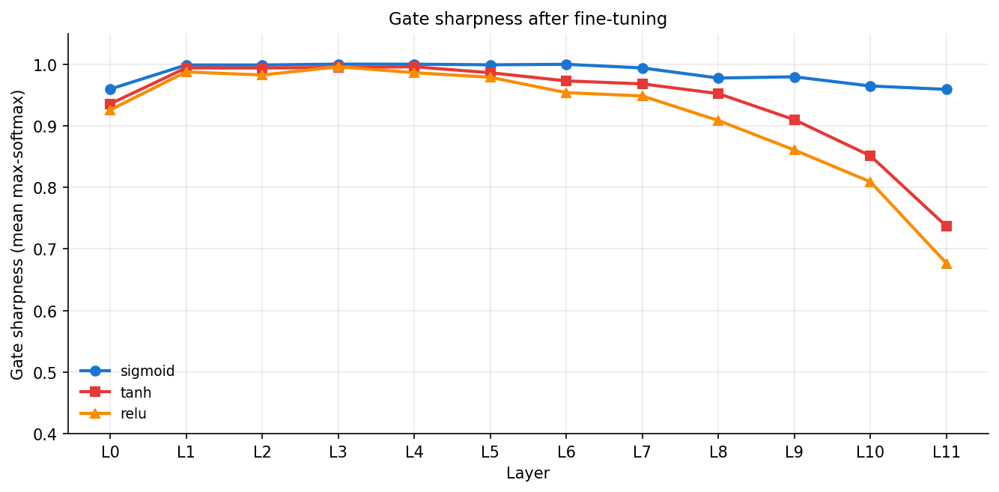

## 1.2 Dropout testai

Dropout pridėjimas tik pablogina rezultatus.

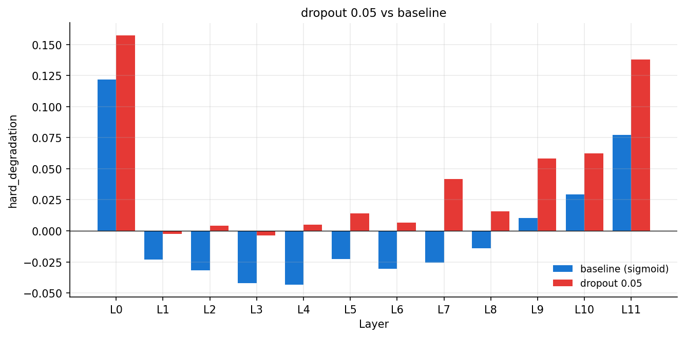
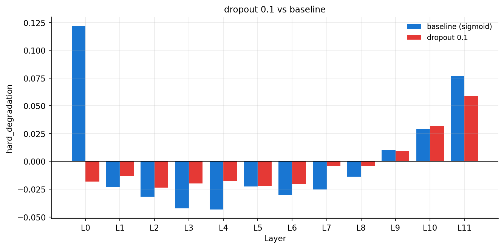

## 1.3 Per-layer annealing

Nepadeda. Sunkesniems sluoksniams (L0, L11) skyriau daugiau imitation žingsnių, bet rezultatas nebuvo geresnis.

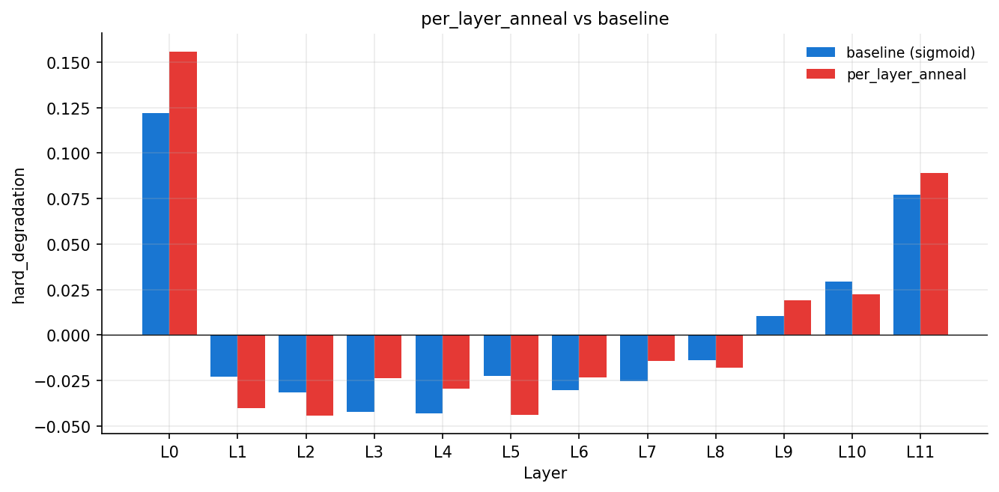

## 1.4 Gilesni pradinis ir galinis sluoksnis

L0 ir L11 padidinau iki depth=3, width_mult=4. Nepadėjo, daugiau gatu greičiausiai lėmė kad snap mode klaidos kaupiasi.

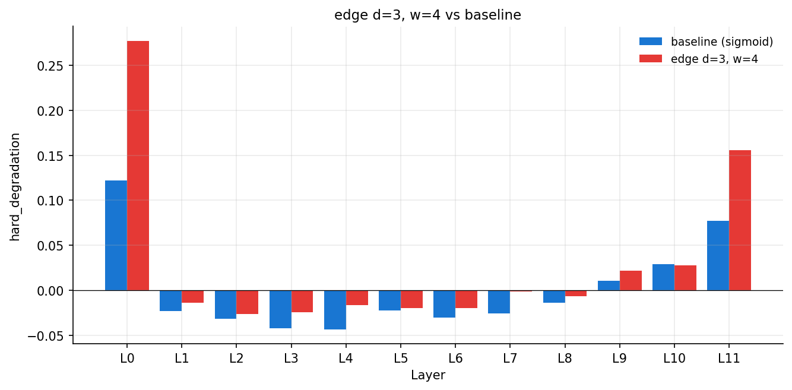

---

## 2. Ablation test

Išbandžiau jūsų siūlytą ablation testą. Pakeičiau LGN vidų į identity  jis tiesiog praleidžia signalą ir neatlieka jokių logikos veiksmų. Jei LGN darytų kažką naudingo, būtų matyti stiprus pablogėjimas, dabar jo nebuvo… Vadinasi LGN iš esmės nieko nedaro.

Manau, jog taip atsitinka dėl linear sluoksniai supančių patį LGN. Prieš ir po LGN yra pilni mokomi Linear sluoksniai, jie galėjo patys išmokti tai, ką turi daryti LGN. Imitation dalyje linear sluoksniai tiesiog perėmė MLP elgesį, o LGN tarp jų tapo beveik kiaurai pereina. Fine-tune metu tai dar labiau sustiprėjo, nes gradientams greičiausiai lengviau eiti per linear sluoksnius nei per LGN su jos temperatūros annealingu.

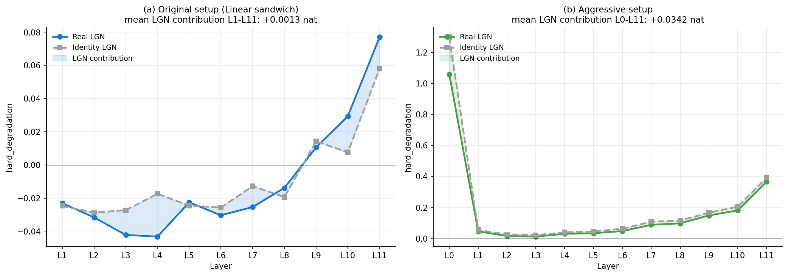

---

## 3. LGN panaudojimas

Kadangi, kaip suprantu, projekto tikslas yra išsiaiškinti LGN, o ne Linear sluoksnių pritaikymą transformeriuose, išbandžiau, kaip juos galima priversti veikti. Bandžiau pašalinti linear sluoksnius.

Šalinau po vieną:

- **binary_io** — LGN įvestis binary per Straight-Through Estimator threshold (0/1). Dabar LGN gauna Bool signalą, ne continuous.
- **sum_pool** — out_proj Linear pakeistas fiksuotu group-sum (padalina width į grupes po 16, susumuoja).
- **no_in_proj** — ir in_proj Linear išmestas.

Galutinė konfigūracija (aggressive setup) – LGN, kuriame tik LGN dalis yra mokoma; viskas kita (binarizacija, sum_pool) yra fiksuota. Kuo mažiau Linear pagalbos, tuo modelis labiau blogėjo, bet tuo aiškiau pradėjo matytis tikras LGN. Kai aggressive setup LGN pakeičiama į identity, skirtumas jau aiškiai matomas. Vidutinis LGN įnašas — apie +0.034 nat per sluoksniui, o per visus 12 sluoksnių kaupiamai apie +0.38 nat. Pirmą kartą galim sakyti, kad pati LGN dalis kažką realiai atlieka.

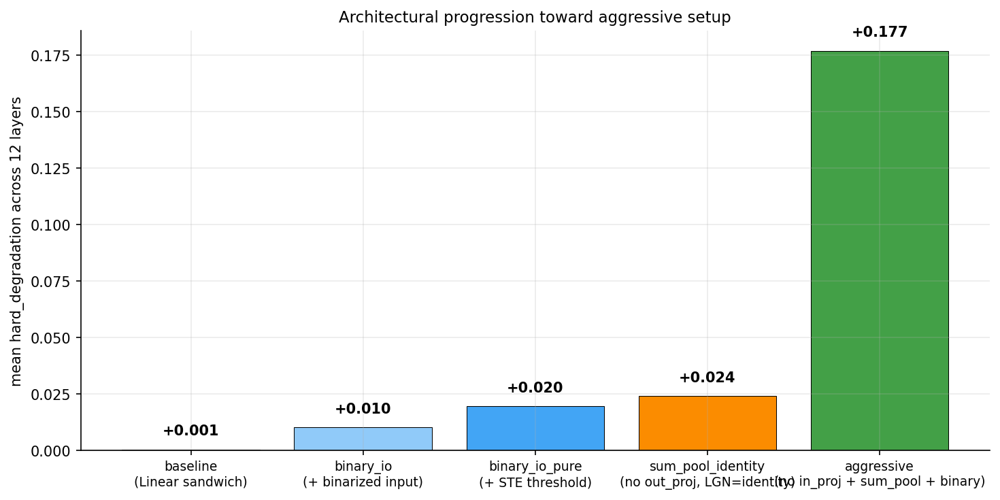
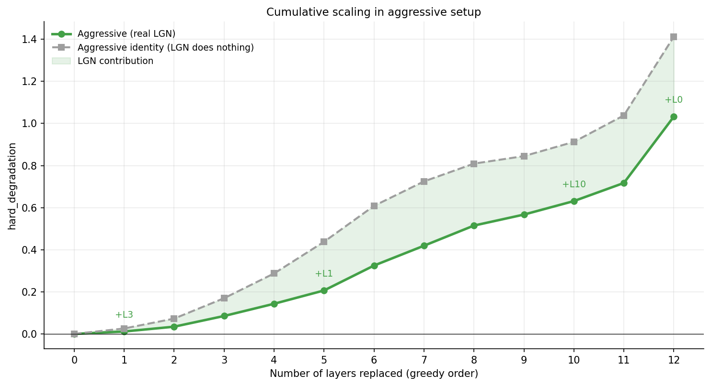

Aggressive setup LGN nedirba visuose sluoksniuose vienodai. Kai kiekvieną sluoksnį pakeitę į LGN palyginu su tuo pačiu sluoksniu pakeistu į identity, skirtumas yra didelis tik keliuose, daugiausia L0 ir paskutiniuose sluoksniuose (L10, L11). L0 vienas duoda didžiąją dalį viso LGN įnašo. Vidurio sluoksniuose (L1–L9) LGN įnašas labai nedidelis.

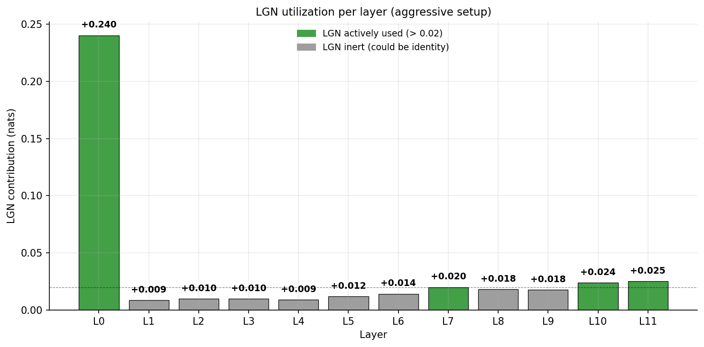

## 3.2 Bandymai pagerinti aggressive setup

Bandžiau pakeisti:

- **K=32** — dvigubai connection capacity. Nieko reikšmingo neduoda.
- **ft2k** — dvigubai fine-tune žingsnių. Šiek tiek pagerina.
- **skipgate** — learnable scalar, kuris padaugina LGN įnašą prieš residual. Nedidelis pagerėjimas.
- **per-layer anneal** — sunkesniems sluoksniams daugiau imitation žingsnių. Nepadėjo, šiek tiek blogina.

Visi pavieniai pataisymai duoda vos kelių procentų naudą. Bandžiau dar stack'inti du geriausius : skipgate + ft2k. Rezultatai pablogėji.

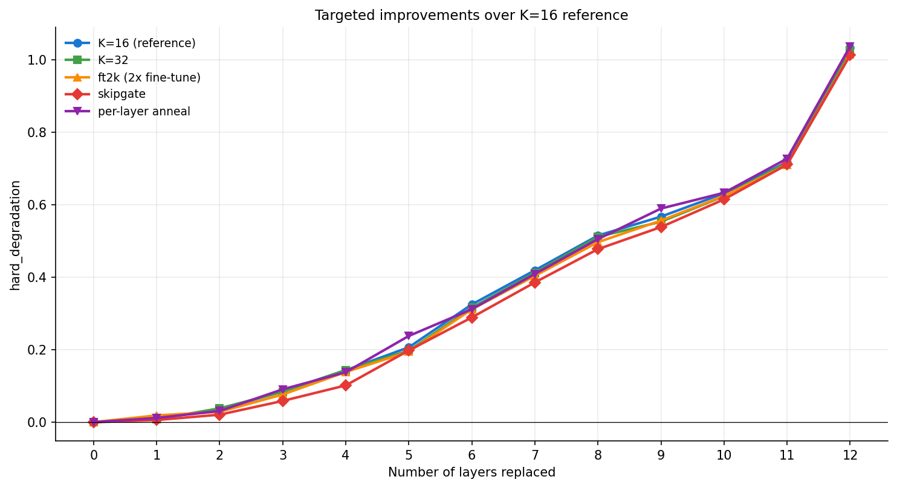
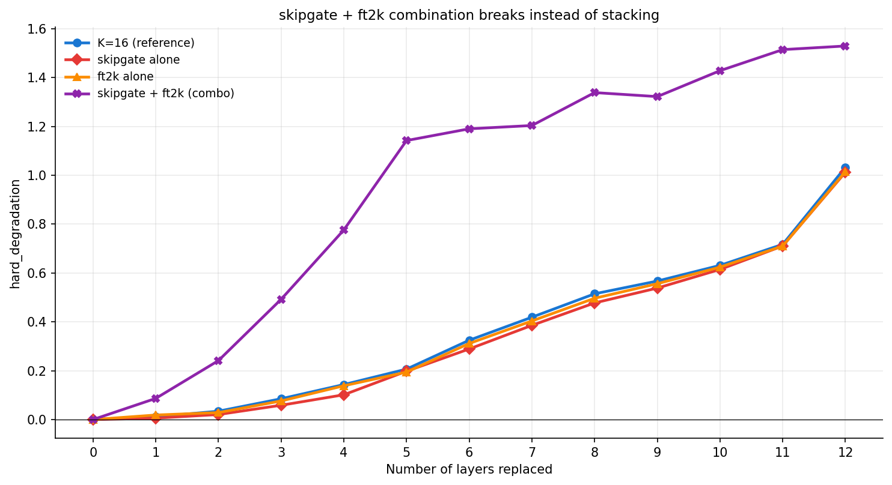

Dabar kai žinome, jog bent pats LGN kažką daro, bandysiu dar jį optimizuoti. Tradicianiai pakeitimai daug nedavė, tačiau planuoju išbanyti pridėti hibridinius sluoksnius. Jie greičiausiai būtų pritaikyti kraštiniams sluoksniams. Ten paliekamas originalus transformer'io attention, paimtas iš baseline'o (jis jau apmokytas, pre-baked) keičiama tik MLP dalis į LGN.

---

## 4. Pilnas modelis vs transformer (accuracy)

Iki šiol matavom degradaciją tik per loss (nats). Įdomu pamatyti, ką tai reiškia praktiškai — kiek next-byte spėjimų teisingi (accuracy).

Trijų modelių palyginimas, visi 12 MLP sluoksnių pakeisti, bazė užšaldyta:

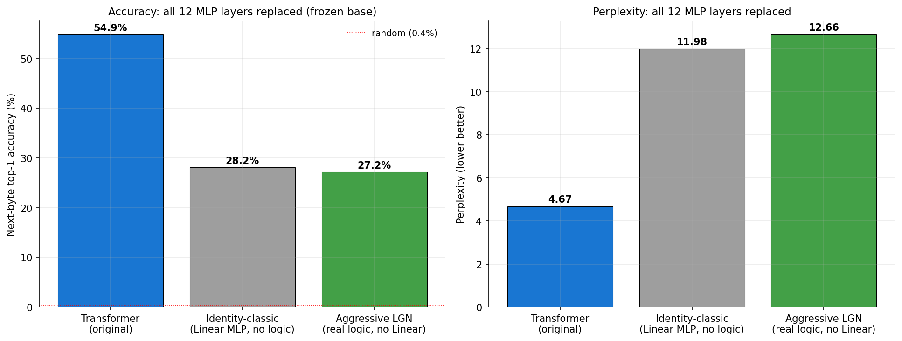

| Modelis | loss | perplexity | accuracy |
|---|---:|---:|---:|
| Transformer (originalas) | 1.54 | 4.67 | **54.9%** |
| Identity-classic (Linear MLP, jokios logikos) | 2.48 | 11.98 | 28.2% |
| Aggressive LGN (tikra logika, be Linear) | 2.54 | 12.66 | 27.2% |

Įdomus radinys: **identity-classic** (Linear sluoksniai be loginių vartų) yra **beveik toks pat blogas** kaip aggressive LGN. Pakeitus visus 12 MLP'ų užšaldytoje bazėje, kokybė nukrenta perpus **nepriklausomai nuo metodo**. Tad gap iki transformer'io daugiausia nėra "logika silpna" — tai bendras kainos paliepimas keisti visus MLP'us. Pozityvus kampas: aggressive LGN pasiekia tą pačią accuracy kaip Linear sandwich **be jokio float matmul** bloke.

## 5. Gryno LGN ribos (I/O bottleneck atakos)

Užšaldytos bazės kontekste bandžiau pagerinti patį LGN per I/O kanalus:

- **n_bits=16** — turtingesnė įvestis (finesnė embedding binarizacija)
- **depth=2** — daugiau loginės talpos
- **pool_weighted** — turtingesnė išvestis (mokami per-bit svoriai vietoj uniform sum)

| Konfiguracija | accuracy | vs baseline |
|---|---:|---:|
| Aggressive + learn_pool (baseline) | 27.2% | — |
| + n_bits=16 (input) | 27.6% | +0.4% |
| + depth=2 (capacity) | 25.5% | **−1.7%** (blogiau) |
| + pool_weighted (output) | 27.4% | +0.2% |

Visi pataisymai **per noise floor** (±0.5 ppt). Daugiau loginių vartų net pablogina (snap klaidos kaupiasi).

**Išvada:** grynas LGN saturavęs ties ~27% — struktūrinė riba šitam setup'ui (pointwise LGN, užšaldyta bazė, visi 12 sluoksnių).

## 6. Hybrid L0 — architektūrinis apėjimas

Paliekant **attention L0 sluoksnyje** (jis apdoroja raw embedding'ą, kur cross-token mixing kritinis), accuracy šokteli dramatiškai:

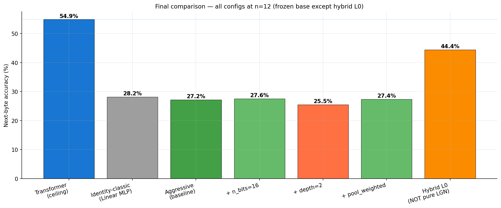

| Modelis | accuracy |
|---|---:|
| Aggressive LGN (visi 12) | 27.2% |
| **Hybrid L0 + aggressive LGN** | **44.4%** |
| Transformer (ceiling) | 54.9% |

**+17 punktų vien iš vieno architektūrinio sprendimo.** Tai parodo, kad gap iki transformer'io koncentruotas **L0** sluoksnyje, kur LGN fundamentaliai negali atlikti reikiamo darbo (pointwise vartai negali maišyti tokenų — tai attention darbas).

Hybrid uždaro **daugiau nei pusę** likusio gap'o (27→44, kelias iki 55). Tai ne pure LGN — bet aiškiai rodo, kur LGN "lubos" ir kur architektūrinė nuolaida turi prasmę.

## 7. Literatūros įžvalgos (2025 darbai)

Naujausi DLGN tyrimai sutinka su mūsų pastebėjimais ir siūlo konkrečius sprendimus:

- **["Mind the Gap"](https://arxiv.org/abs/2506.07500) (NeurIPS 2025)** — adresuoja būtent mūsų soft-hard gap problemą. Sprendimas: **Gumbel noise + STE** treniravimo metu. Rezultatai: 98% sumažintas discretization gap, 100% sumažintas neaktyvių vartų skaičius, 4.5× greitesnė konvergencija. **Tiesiogiai pritaikoma** mūsų pipeline'ui.

- **["Light DLGN"](https://arxiv.org/abs/2510.03250) (2025)** — vartų **reparametrizacija**. Sumažina parametrus 4×, backward 1.86× greitesnis, 8.5× mažiau žingsnių. Daugiau apie efektyvumą nei kokybę, bet supaprastina training'ą.

- **["Recurrent DDLGN"](https://arxiv.org/abs/2508.06097) (2025)** — *būtent* mūsų cross-token apribojimo sprendimas. Į loginį tinklą įdedami **stateful vartai (flip-flops, latches)**, kurie leidžia logikai dirbti su sekomis. WMT'14 vertimas: 5.0 BLEU (vs GRU 5.4), su **20,000× mažiau loginių operacijų**. Tai realus kelias atsisakyti attention'o **pačiame LGN** lygyje.

### Konkretūs kiti žingsniai (informatyvūs literatūros)

1. **Gumbel-STE treniravimas** (Mind the Gap idėja) — pakeisti dabartinį hard/soft STE į Gumbel-noise versiją. Tikėtina nauda: mažesnis soft-hard gap, mažiau neaktyvių vartų, greitesnis treniravimas. **Pigus pataisymas, didelis potencialas.**

2. **Stateful gates aggressive setup'e** (RDDLGN principas) — perdaryti LGN bloką taip, kad jis turėtų latent state'ą, perduodamą tarp tokenų. Tai leistų LGN dalinai pakeisti attention darbą be float matmuls. **Didelis architektūrinis pakeitimas, ilgalaikis tyrimas.**

3. **Light DLGN reparametrizacija** — perrašyti `LearnedLogicLayer` su nauja parametrizacija. Mažiau svarbu kokybei, bet padaro treniravimą greitesnį ir mažiau VRAM reikia.

**Mano rekomendacija:** pradėti nuo **#1 (Gumbel-STE)** — pigu, tiesiogiai pritaikoma, ir literatūra rodo aiškią naudą būtent discretization gap'o problemai, kurią mes pastebėjom.
